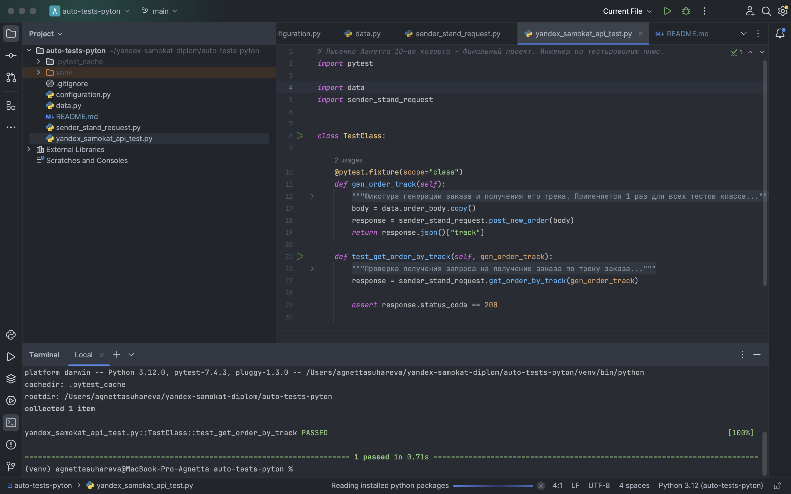

# Автоматизация теста к API - получение данных о заказе по треку
- Для запуска тестов должны быть установлены пакеты **pytest**
- Запуск всех тестов выполняется командой **pytest** (например: **pytest -v**)

## Описание проекта
- Реализован класс для тестов **TestClass**
  - Для генерации одного заказа и получения его трек-номера для всех тестов использована фикстура **gen_order_track**
  - Использованная реализация позволит в будущем с легкостью добавить любые другие тесты, внося минимальные изменения в код

## Скриншот работы теста
